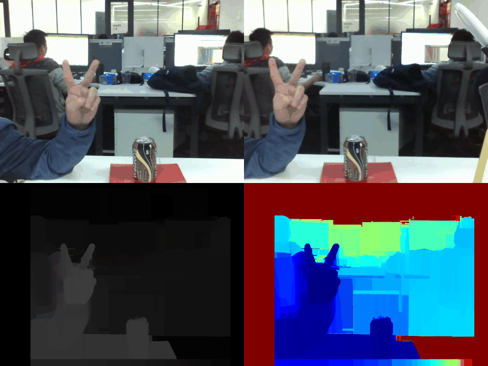
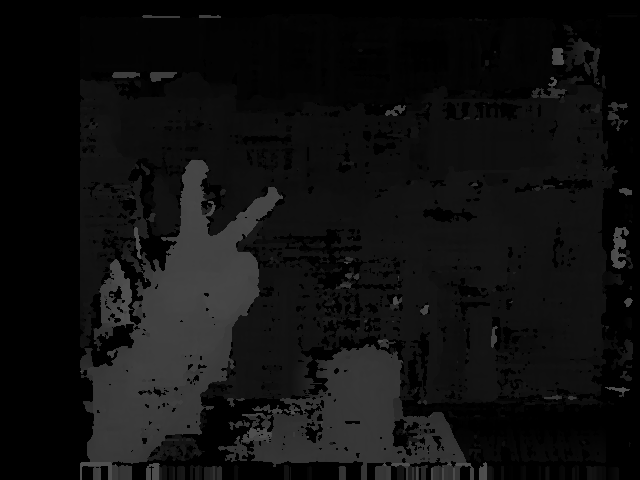
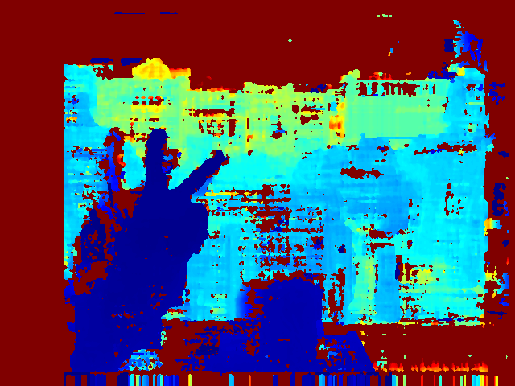
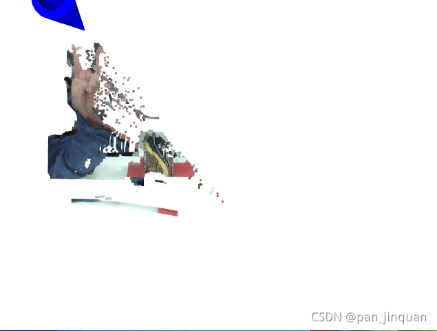
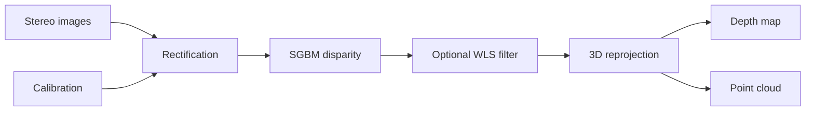

# Stereo 3D Reconstruction

**Stereo depth estimation and point cloud visualization with OpenCV.**

A Python stereo vision project covering image capture, camera calibration, stereo rectification, SGBM disparity estimation, and 3D visualization with Open3D or PCL.

[Setup](docs/SETUP.md) · [Project structure](docs/PROJECT_STRUCTURE.md) · [References](THIRD_PARTY_NOTICES.md)

## Preview

Example outputs included with the project:



| Disparity | Depth |
| --- | --- |
|  |  |



## Features

- Checkerboard-based monocular and stereo calibration.
- Lens distortion correction and stereo rectification.
- SGBM disparity estimation with optional WLS filtering.
- Disparity reprojection into 3D coordinates.
- Depth map display and Open3D / PCL point cloud visualization.
- Processing interfaces for image pairs, paired videos, and camera streams.

## Pipeline



## Usage

See the [setup guide](docs/SETUP.md) for environment requirements. Run commands from the repository root in a compatible desktop environment.

```bash
python demo.py
```

The default demo reads the paired videos in `data/lenacv-video/` and the calibration file `configs/lenacv-camera/stereo_cam.yml`.

To disable WLS filtering:

```bash
python demo.py --filter false
```

Press **Q** to exit, or **S / C** to save images to `data/temp/` while a display window is focused.

## Technical notes

The reconstruction pipeline uses classical stereo geometry. Its output is depth and point clouds; mesh reconstruction and multi-frame fusion are outside the current scope.

The visualization code targets a legacy Open3D API. The dependency files are historical environment references, not a tested installation lock. Camera operation, measurement accuracy, and end-to-end frame rate require validation on the target system.

Calibration must match the camera pair, image resolution, and physical scale. Recalibrate when changing the capture setup.

## References and attribution

Source credits and reference links are retained in the code. See [Third-party notices](THIRD_PARTY_NOTICES.md) for attribution and license status.
